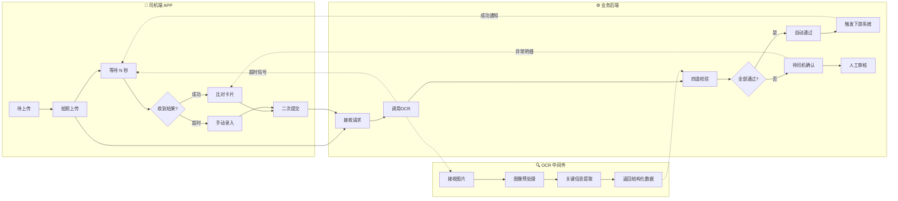
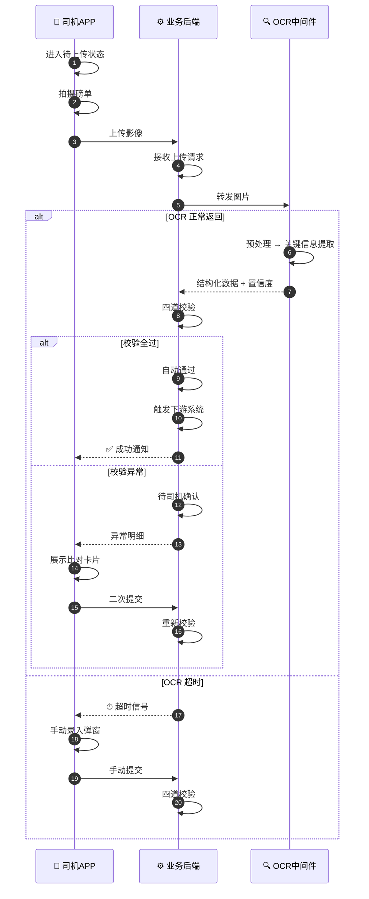
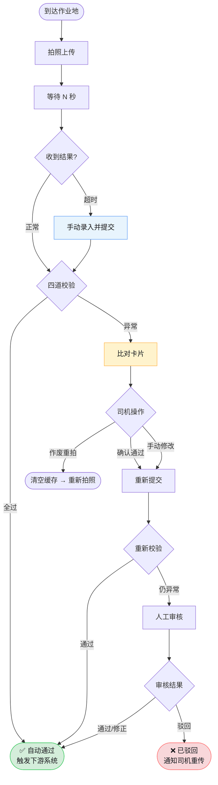
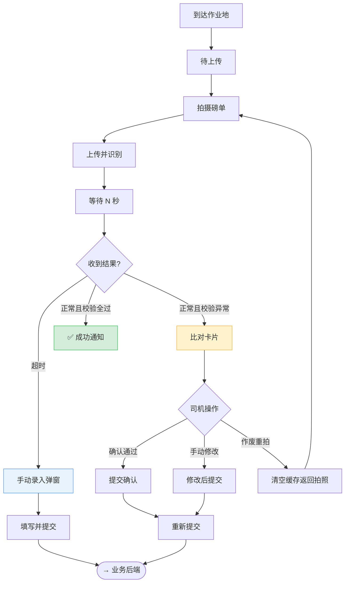
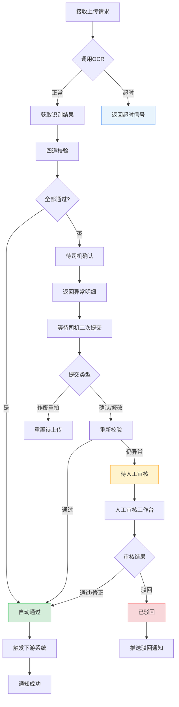
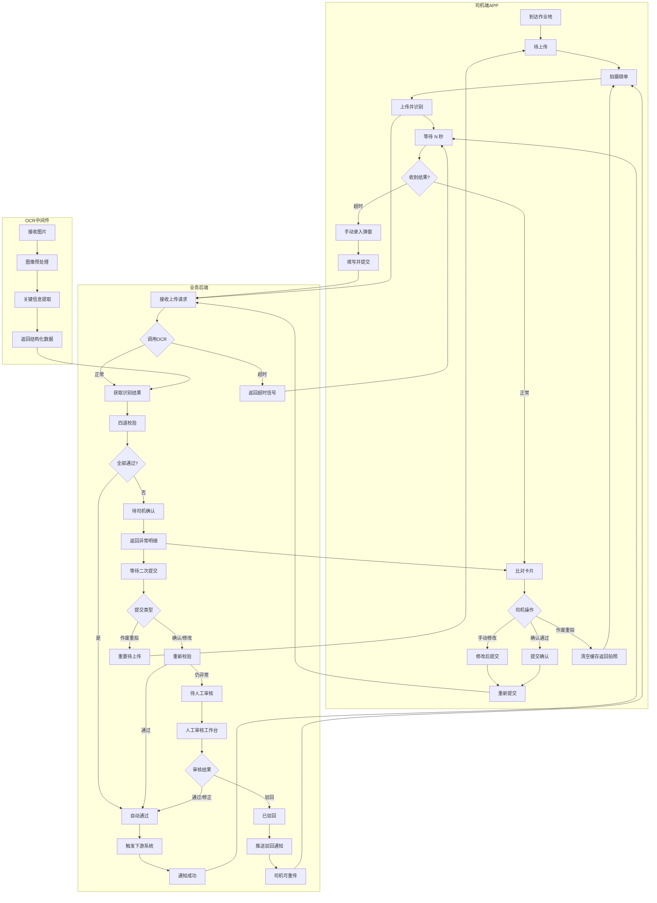

# PRD：OCR 装卸货磅单识别

| 属性 | 内容 |
|------|------|
| **文档版本** | v1.7 |
| **创建日期** | 2026-06-13 |
| **所属系统** | 开沃数智化新能源大宗物流综合运营平台 · 物流运输智运中心 |
| **模块名称** | OCR 装卸货磅单识别 |
| **优先级** | P0（电子回单与结算闭环关键路径） |
| **计划周期** | 2026.07 – 2026.09（与「电子回单与作业执行」里程碑对齐） |

---

## 1. 文档概述

### 1.1 背景

大宗物流装卸货环节长期依赖**纸质磅单**作为货量结算依据。行业普遍存在以下问题：

- **手工抄录易错易改**：地磅房人工填单、司机代填，皮重/毛重/净重被篡改，形成「作弊黑洞」
- **场站数字化程度参差**：部分矿区、钢厂、港口尚未开放地磅 API，无法做到传感器级直连
- **回单回收滞后**：纸质磅单需物理回收、扫描归档，回单流转周期长达 1–2 天，阻塞财务结算
- **多方对账扯皮**：TMS 预估货量 vs 实际过磅净重不一致时，缺乏可信、可追溯的电子凭证

平台已在路线规划中明确「地磅数据 API 直连与自动回传」为首选方案。本 PRD 定义 **OCR 磅单识别** 作为**补充与兜底能力**：当 API 不可用时，通过司机拍照上传，系统自动识别关键字段、校验、存证并写入运单，支撑电子回单与结算对撞。

### 1.2 产品定位

> **一句话**：让每一张纸质装卸货磅单，在 30 秒内变成可校验、可存证、可结算的结构化电子数据。

OCR 磅单识别不是替代地磅 API，而是：

1. **离线场站兜底**：无 API 场站的数字化入口
2. **双轨校验**：有 API 场站可同时留存磅单影像，与 API 回传数据交叉验证
3. **电子回单组成件**：与签名、GPS、时间戳共同构成区块链电子回单

### 1.3 范围边界

**In Scope（本期）**

- 司机 APP 磅单全流程：待上传 → 拍照 → 上传识别 → 等待 N 秒 → 比对卡片 / 手动录入 / 成功通知
- OCR 中间件：图像预处理 → 关键信息提取 → 结构化数据 + 置信度
- 业务后端：四道校验、状态流转、司机二次提交、人工审核工作台
- 司机端三种处置：确认通过 / 手动修改 / 作废重拍
- OCR 超时（N 秒，可配置）降级为手动录入，不阻塞现场作业
- 自动通过后触发运输管理 / 企业资源 / 仓储管理系统
- 影像存证、识别日志、审计追溯

**Out of Scope（本期不做）**

- 地磅硬件/API 对接（独立 PRD）
- 通用票据 OCR（发票、合同等）
- 磅单版式自定义设计器（二期考虑模板自助配置）
- 司机提交申诉
- 区块链存证链上部署细节（沿用电子回单统一方案）

---

## 2. 目标与成功指标

### 2.1 业务目标

| 目标 | 说明 |
|------|------|
| 消灭纸质回单依赖 | 无 API 场站同样实现电子磅单闭环 |
| 缩短回单周期 | 磅单数据从「T+1~2 天」缩短至「作业当场实时」 |
| 降低结算争议 | 结构化磅单 + 影像存证，支撑多源对撞 |
| 防作弊 | 识别异常、重量突变、时空不一致自动拦截 |

### 2.2 量化指标（上线后 3 个月）

| 指标 | 基线 | 目标值 |
|------|------|--------|
| 磅单 OCR 字段识别准确率（核心字段） | — | ≥ 95% |
| 单张磅单从拍照到入库 P95 耗时 | 人工录入 ~5 min | ≤ 30 s（含 OCR + 自动校验） |
| 自动通过率 | — | ≥ 70%（四道校验全过，无需司机二次操作） |
| OCR 超时降级可用率 | — | 100%（等待 N 秒超时后必出手动录入） |
| 需人工审核比例 | 100% 人工 | ≤ 15% |
| 磅单相关结算争议率 | 行业约 8–12% | 下降 50% |
| 无 API 场站电子磅单覆盖率 | 0% | ≥ 90% |

---

## 3. 用户与场景

### 3.1 目标用户

| 角色 | 诉求 | 使用终端 |
|------|------|----------|
| **重卡司机（自有/外协）** | 装卸货后快速完成回单，少填表、少排队 | 司机 APP / 微信小程序 |
| **调度/车队长** | 实时掌握过磅进度，异常磅单及时处理 | Web / APP 消息 |
| **财务/结算员** | 获取可信净重，参与多源对撞 | TMS Web 结算中心 |
| **异常仲裁专员** | 纠纷时调取磅单影像 + 识别记录 | 全景快照系统 |

### 3.2 核心场景

#### 场景一：主路径 — 四道校验全过，自动通过

1. 司机到达作业地，APP 运单进入**待上传**状态
2. 拍摄磅单 → 点击「上传并识别」
3. 后端接收请求，调用 OCR 中间件完成识别
4. 四道校验全部通过
5. 磅单状态置为**自动通过**，自动触发运输管理 / 企业资源 / 仓储管理系统
6. 司机端在 N 秒内收到**成功通知**，无需操作比对卡片，可继续行程

#### 场景二：校验异常 — 比对卡片二次确认

1. OCR 正常返回，但四道校验存在异常
2. 磅单状态置为**待司机确认**
3. 后端返回异常明细，司机端展示**比对卡片**
4. 司机三选一：
   - **确认通过** → 重新校验
   - **手动修改** → 修正字段后重新校验
   - **作废重拍** → 清空缓存，回到拍照
5. 重新校验通过 → **自动通过**；仍异常 → **待人工审核**（系统自动进入，无需司机发起）

#### 场景三：OCR 超时 — 手动录入降级

1. 司机上传后等待 N 秒，后端 OCR 调用超时
2. 弹出**手动录入弹窗**，司机填写核心字段
3. 提交后仍走四道校验，不跳过风控
4. 后续进入场景一或场景二

#### 场景四：人工审核 — 二次校验仍异常

1. 司机确认/修改后重新校验仍异常，或第四道校验触发高风险直接入队
2. 磅单进入**人工审核工作台**，状态为**待人工审核**
3. 审核员对照影像处理：
   - **通过/修正** → **自动通过** → 触发下游系统
   - **驳回** → **已驳回** → 推送通知 → 司机重传

#### 场景五：作废重拍

1. 司机在比对卡片选择「作废重拍」
2. 后端重置为待上传状态，清空当前影像缓存
3. 司机回到 APP 待上传，重新拍摄

#### 场景六：装货磅单（对称流程）

与卸货流程完全一致，磅单类型为装货磅单，净重参与发货量核算。

#### 场景七：纠纷仲裁调取

仲裁员输入运单号，全景快照展示：轨迹 + 围栏 + 磅单影像 + OCR 结果 + 状态流转时间线 + 审核记录。

---

## 4. 业务流程

> **阅读建议：** 先看 **4.1 总览** → **4.2 时序交互** → **4.3 路径决策**；实现细节查 **4.4 分层详图** 与 **4.5 流程步骤说明**。

### 4.1 三层架构总览

系统由司机端 APP、OCR 中间件、业务后端三层协同，一次上传识别的主链路如下：



| 层级 | 核心职责 | 关键产出 |
|------|----------|----------|
| 司机端 APP | 现场采集、等待反馈、异常处置 | 磅单影像 / 手动录入 / 二次确认 |
| OCR 中间件 | 图像识别与结构化 | 结构化数据 + 逐字段置信度 |
| 业务后端 | 校验、状态流转、下游触发 | 磅单状态 + 下游系统事件 |

### 4.2 跨系统时序交互

展示三层之间的请求/响应顺序与分支逻辑：



### 4.3 业务路径决策树

从司机视角归纳全部业务分支（对应 6 条核心路径）：



| 路径 | 触发条件 | 司机端表现 | 终态 |
|------|----------|------------|------|
| 🟢 **主路径** | OCR 正常 + 四道校验全过 | 成功通知 | 自动通过 |
| 🟡 **比对卡片** | OCR 正常 + 校验异常 | 三按钮操作 | 重新校验 → 通过或进审核 |
| 🔵 **手动录入** | OCR 等待 N 秒超时 | 手填弹窗 | 提交后重新校验 |
| 🟠 **人工审核** | 二次校验仍异常 / 高风险 | 等待核实 | 待人工审核 |
| 🔴 **驳回重传** | 审核驳回 | 通知 + 重传入口 | 已驳回 → 重新拍照 |
| ⚪ **作废重拍** | 司机放弃当前影像 | 回到拍照 | 重置为待上传 |

### 4.4 分层流程详图

#### 4.4.1 司机端 APP



#### 4.4.2 业务后端



#### 4.4.3 OCR 中间件


### 4.5 流程步骤说明

#### 司机端 APP

| 步骤 | 环节 | 说明 |
|------|------|------|
| 1 | 到达作业地 | 围栏触发，运单进入作业态 |
| 2 | 待上传 | 展示上传入口 |
| 3 | 拍摄磅单 | 相机/相册 + 质量检测 |
| 4 | 上传并识别 | 提交影像至业务后端 |
| 5 | 等待 N 秒 | 倒计时 + 轮询状态（N 为可配置参数） |
| 6 | 收到结果？ | 超时 vs 正常分支 |
| 7 | 手动录入弹窗 | OCR 超时降级 |
| 8 | 填写并提交 | 数据来源标记为手动录入 |
| 9 | 比对卡片 | 校验异常时展示差异对照 |
| 10 | 司机操作 | 确认 / 修改 / 重拍 三选一 |
| 11 | 重新提交 | 携带操作类型与修正字段 |

#### OCR 中间件

| 步骤 | 环节 | 说明 |
|------|------|------|
| 1 | 接收图片 | 接收业务后端转发的影像 |
| 2 | 图像预处理 | 去噪、纠偏、对比度增强 |
| 3 | 关键信息提取 | 识别磅单核心字段 |
| 4 | 返回结构化数据 | 字段值 + 逐字段置信度 |

#### 业务后端

| 步骤 | 环节 | 说明 |
|------|------|------|
| 1 | 接收上传请求 | 统一入口（含影像与手动录入） |
| 2 | 调用 OCR | 异步识别，含超时处理 |
| 3 | 四道校验 | 决定自动通过或待司机确认 |
| 4 | 自动通过 | 触发下游 + 推送成功通知 |
| 5 | 待司机确认 | 返回异常明细，等待二次提交 |
| 6 | 重新校验 | 司机确认或修改后再次校验 |
| 7 | 待人工审核 | 二次校验仍异常或高风险触发 |
| 8 | 人工审核 | 通过/修正/驳回 |
| 9 | 已驳回 | 通知司机，允许重传 |
| 10 | 重置待上传 | 作废重拍后清空当前版本 |

<details>
<summary>📎 附录：完整跨层参考图</summary>



</details>

### 4.6 子系统职责

| 子系统 | 职责 | 关键环节 |
|--------|------|----------|
| **司机端 APP** | 现场采集、结果确认、异常处置 | 拍照上传、等待 N 秒、比对卡片、手动录入/重拍 |
| **OCR 中间件** | 图像识别与结构化 | 预处理 → 关键信息提取 → 结构化数据 |
| **业务后端** | 校验、状态流转、下游触发 | 四道校验、状态驱动、下游系统联动、人工审核 |

### 4.7 四道校验

| 道次 | 校验项 | 失败处置 |
|------|--------|----------|
| 第一道 | 字段完整性：核心 9 字段非空 + 识别置信度达标 | → 待司机确认 |
| 第二道 | 逻辑自洽：净重 = 毛重 − 皮重 | → 待司机确认 |
| 第三道 | 业务匹配：车牌、收发货方、货物品类与运单一致 | → 待司机确认 |
| 第四道 | 风控对撞：围栏时段、预估偏差、API 双轨偏差、时空冲突 | 超阈值 → 待司机确认；高风险 → 直接待人工审核 |

四道全部通过 → **自动通过**，自动触发下游系统，司机端收到成功通知，**无需展示比对卡片**。

### 4.8 司机端比对卡片

校验未全部通过时，后端返回异常明细，司机端展示**比对卡片**：

- 左侧：磅单原图缩略图
- 右侧：OCR 识别值 vs 运单/API 参考值，差异字段红色高亮
- 底部三按钮：**确认通过** / **手动修改** / **作废重拍**

| 操作 | 含义 | 后端处理 |
|------|------|----------|
| 确认通过 | 司机认可 OCR 结果及异常提示 | 重新校验 |
| 手动修改 | 司机修正部分字段后提交 | 重新校验 |
| 作废重拍 | 放弃当前影像，清空本地缓存 | 重置为待上传 |

> 重新校验仍异常时，系统自动转入**待人工审核**，司机端提示「已提交，调度将核实」，无需司机额外操作。

### 4.9 超时参数配置

识别等待时间**不固定写死**，统一由可配置参数 **N（秒）** 控制，支持按场站 / 租户差异化设置。

| 参数 | 含义 | 配置层级 | 取值建议 |
|------|------|----------|----------|
| **N** | 司机端等待识别结果的超时时间（秒） | 场站 / 租户 | 10 – 60 |
| **M** | 后端 OCR 调用超时时间（秒） | 系统 / 场站 | M ≤ N − 3（预留网络缓冲） |

**配置原则：**

- 司机端倒计时、超时弹窗、轮询截止时刻均以 **N** 为准
- 后端 OCR 调用超时 **M** 应略小于 N，确保超时信号先于司机端倒计时结束返回
- 修改 N 后，司机 APP 从配置接口拉取最新值，无需发版
- 推荐默认值：N = 15，M = 12（仅为出厂默认，可按场站覆盖）

### 4.10 OCR 超时降级

- 司机端等待识别结果 **N 秒**（见 4.9，可配置）
- 后端 OCR 在 **M 秒**内未返回有效结果 → 向司机端下发超时信号 → 弹出**手动录入弹窗**
- 手动录入提交后由业务后端接收，标记为手动录入来源，仍走四道校验

### 4.11 下游触发

**自动通过**后系统自动推送：

| 下游系统 | 触发内容 |
|----------|----------|
| **运输管理系统（TMS）** | 更新运单装卸货净重、推进运单状态（已装货/已卸货） |
| **企业资源系统（ERP）** | 同步货量至出入库台账 |
| **仓储管理系统（WMS）** | 更新场站库存与作业记录 |
| **电子回单** | 磅单影像 + OCR 结果 + GPS 时间戳存证 |
| **结算引擎** | 写入实际净重，参与多源对撞 |

### 4.12 磅单类型

| 类型 | 业务含义 | 必填时机 |
|------|----------|----------|
| 装货磅单 | 发货地过磅，确认发货净重 | 装货完成出园前 |
| 卸货磅单 | 收货地过磅，确认收货净重 | 卸货完成出园前 |
| 复磅/抽检 | 异常复磅 | 按需 |

### 4.13 与运单状态联动

| 磅单状态 | 运单影响 |
|----------|----------|
| 自动通过 | 装货 → 允许发运；卸货 → 允许进入回单确认 |
| 待司机确认 | 运单保持当前状态，阻塞结算 |
| 待人工审核 | 运单标记「磅单待审」，调度/财务可见 |
| 已驳回 | 司机需重传，运单阻塞结算 |
| 磅单缺失超时（默认 2h） | 触发调度预警 |

---

## 5. 功能需求

### 5.1 司机端 APP

| 编号 | 需求描述 | 优先级 |
|------|----------|--------|
| F-001-01 | 到达作业地后运单自动进入「待上传」状态 | P0 |
| F-001-02 | 支持相机拍照 / 相册选取，引导框 + 质量检测（模糊/反光/倾斜） | P0 |
| F-001-03 | 「上传并识别」按钮，附带 GPS、设备 ID、运单号、围栏事件 ID | P0 |
| F-001-04 | 识别等待页：N 秒倒计时 + 加载动画（N 从配置接口获取） | P0 |
| F-001-05 | 等待 N 秒超时后弹出手动录入弹窗，字段与 OCR 输出结构一致 | P0 |
| F-001-06 | 校验异常时展示比对卡片：原图 + 差异字段 + 三按钮 | P0 |
| F-001-07 | 作废重拍：清空本地影像缓存，回到待上传/拍照 | P0 |
| F-001-08 | 四道校验全过时展示成功通知，无需比对卡片 | P0 |
| F-001-09 | 弱网断点续传、本地缓存补传 | P1 |

**交互原则：** 自动通过主路径 ≤ 3 次点击；关键按钮字号 ≥ 18sp；支持语音播报。

### 5.2 OCR 中间件

| 编号 | 需求描述 | 优先级 |
|------|----------|--------|
| F-002-01 | 接收业务后端转发的磅单影像 | P0 |
| F-002-02 | 图像预处理：去噪、纠偏、对比度增强 | P0 |
| F-002-03 | 关键信息提取，覆盖打印体与常见手写数字/车牌 | P0 |
| F-002-04 | 返回结构化结果 + 逐字段置信度（0–1） | P0 |
| F-002-05 | 服务端 P95 ≤ 3s；超过 M 秒由业务后端返回超时信号 | P0 |
| F-002-06 | 支持磅单版式模板库（按场站配置） | P1 |

### 5.3 业务后端

#### 5.3.1 上传与 OCR 调度

| 编号 | 需求描述 | 优先级 |
|------|----------|--------|
| F-003-01 | 接收司机上传请求（含影像、手动录入数据） | P0 |
| F-003-02 | 异步调用 OCR 中间件，超时阈值 M 秒（M ≤ N − 3，见 4.9） | P0 |
| F-003-03 | OCR 超时返回超时信号，驱动司机端手动录入 | P0 |
| F-003-04 | 接收 OCR 结果后执行四道校验 | P0 |

#### 5.3.2 四道校验与状态流转

| 编号 | 需求描述 | 优先级 |
|------|----------|--------|
| F-003-05 | 校验全过 → 自动通过 → 触发下游系统 → 推送成功通知 | P0 |
| F-003-06 | 校验未全过 → 待司机确认 → 返回异常明细 | P0 |
| F-003-07 | 接收司机二次提交，按操作类型分流处理 | P0 |
| F-003-08 | 确认/修改后重新校验；通过 → 自动通过，仍异常 → 待人工审核 | P0 |
| F-003-09 | 作废重拍 → 重置为待上传，作废当前磅单版本 | P0 |

#### 5.3.3 司机二次提交类型

| 操作类型 | 含义 | 后端处理 |
|----------|------|----------|
| 确认通过 | 司机认可识别结果 | 重新校验 |
| 手动修改 | 修正字段后提交 | 重新校验（以司机提交值为准） |
| 作废重拍 | 放弃当前影像 | 重置为待上传 |

### 5.4 结构化字段定义

#### 5.4.1 核心字段（参与结算）

| 字段名 | 类型 | 校验规则 | 识别置信度阈值 |
|--------|------|----------|----------------|
| 磅单编号 | 文本 | 非空，场站内唯一 | ≥ 0.85 |
| 车牌号 | 文本 | 与运单绑定车辆一致 | ≥ 0.90 |
| 毛重 (kg) | 数值 | > 0，≤ 车辆核定载质量 × 1.1 | ≥ 0.90 |
| 皮重 (kg) | 数值 | > 0，≤ 毛重 | ≥ 0.90 |
| 净重 (kg) | 数值 | = 毛重 − 皮重（误差 ±0.02t 可配置） | ≥ 0.90 |
| 过磅时间 | 日期时间 | 不晚于当前时间，不早于运单创建时间 | ≥ 0.85 |
| 磅单类型 | 枚举 | 装货 / 卸货 / 复磅 | 业务规则推断 |
| 货物名称 | 文本 | 与运单货物品类模糊匹配 | ≥ 0.80 |
| 发货/收货单位 | 文本 | 与运单收发货方匹配 | ≥ 0.80 |

#### 5.4.2 扩展字段

| 字段名 | 说明 |
|--------|------|
| 司磅员 | 辅助审计 |
| 备注 | 手写备注识别 |
| 磅房名称 | 场站识别 |
| 过磅次数 | 一次磅/二次磅 |

### 5.5 四道校验规则

| 道次 | 编号 | 规则 | 失败处置 |
|------|------|------|----------|
| 第一道 | F-005-01 | 核心 9 字段非空 + 识别置信度达标 | → 待司机确认 |
| 第一道 | F-005-02 | 同运单同类型重复上传需确认覆盖 | → 提示司机 |
| 第二道 | F-005-03 | 净重 = 毛重 − 皮重（±0.02t 可配置） | → 待司机确认 |
| 第三道 | F-005-04 | 车牌与运单绑定车辆一致 | → 待司机确认 |
| 第三道 | F-005-05 | 收发货方、货物品类与运单匹配 | → 待司机确认 |
| 第四道 | F-005-06 | 过磅时间在围栏停留时段内 | → 待司机确认 |
| 第四道 | F-005-07 | 净重较运单预估偏差 > 5%（可配置） | → 待司机确认 |
| 第四道 | F-005-08 | 与地磅 API 偏差 > 50kg（可配置） | → 待司机确认 |
| 第四道 | F-005-09 | 时空冲突（同车牌短时跨场站） | → 直接待人工审核 |

### 5.6 人工审核工作台

| 编号 | 需求描述 | 优先级 |
|------|----------|--------|
| F-006-01 | 队列来源：待人工审核（二次校验仍异常或高风险） | P0 |
| F-006-02 | 左图右表：原图 + 识别值 + 司机修改值 + 参考值 + 置信度 | P0 |
| F-006-03 | 审核通过/修正 → 自动通过 → 触发下游系统 | P0 |
| F-006-04 | 审核驳回 → 已驳回 → 推送通知 → 司机可重传 | P0 |
| F-006-05 | 审核 SLA：超 30 min 升级至车队长 | P1 |
| F-006-06 | 全量审计日志（含审核意见） | P0 |

### 5.7 管理配置

| 编号 | 需求描述 | 优先级 |
|------|----------|--------|
| F-007-01 | 场站级：是否强制上传磅单、API 双轨校验开关 | P0 |
| F-007-02 | 超时参数配置：司机端等待 N（秒）、后端 OCR 调用 M（秒），M ≤ N − 3 | P0 |
| F-007-03 | 四道校验阈值：重量偏差、置信度、围栏时段 | P0 |
| F-007-04 | 磅单模板管理（绑定场站样式） | P1 |
| F-007-05 | 统计看板：自动通过率、比对卡片触发率、人工审核率 | P1 |

### 5.8 下游集成

| 编号 | 下游系统 | 触发时机 | 输出内容 |
|------|----------|----------|----------|
| F-008-01 | 运输管理系统 | 自动通过 | 运单净重、状态推进 |
| F-008-02 | 企业资源系统 | 自动通过 | 货量出入库台账 |
| F-008-03 | 仓储管理系统 | 自动通过 | 场站库存与作业记录 |
| F-008-04 | 电子回单 | 自动通过 | 影像 + 识别结果 + GPS 时间戳 |
| F-008-05 | 结算引擎 | 自动通过 | 实际净重，参与多源对撞 |
| F-008-06 | 异常中心 | 校验失败 / 高风险 | 告警事件推送 |
| F-008-07 | 全景快照 | 全状态 | 影像 + 状态流转时间线 |

---

## 6. 非功能需求

### 6.1 性能

| 项 | 要求 | 说明 |
|----|------|------|
| OCR 接口 P95 响应 | ≤ 3s | 识别中间件全流程 |
| 司机端 OCR 等待超时 | N 秒（可配置） | 超时必出手动录入弹窗 |
| 后端 OCR 调用超时 | M 秒（可配置，M ≤ N − 3） | 返回超时信号给司机端 |
| 影像上传 P95（4G 网络） | ≤ 8s | 拍照上传至后端 |
| 审核台列表加载 | ≤ 2s | 1000 条分页 |
| 并发 | 500 QPS | OCR 识别峰值 |

### 6.2 安全与合规

- 影像及识别结果加密存储，访问需权限授权
- 司机仅可查看/上传本人运单磅单
- 数据保留期 ≥ 3 年（对齐财务审计要求）
- 个人信息脱敏展示

### 6.3 可用性

- OCR 服务可用性 ≥ 99.9%
- 服务降级：OCR 超时或不可用时，手动录入 + 影像存档，不阻塞作业

### 6.4 兼容性

- 司机端：Android 8+、iOS 13+、微信小程序
- 磅单样式：针式打印、热敏窄条、A4 激光打印

---

## 7. 交互设计要点

### 7.1 页面流转

```
待上传 → 拍照 → 上传 → 等待 N 秒
                          ├─ 成功通知 ← 自动通过
                          ├─ 手动录入弹窗 ← OCR超时
                          └─ 比对卡片 ← 校验异常
                                ├─ 确认/修改 → 重新提交
                                └─ 作废重拍 → 重新拍照
                                （仍异常 → 系统自动进人工审核）
```

### 7.2 司机 APP — 上传页

```
┌────────────────────────────────┐
│  ←  上传卸货磅单                │
├────────────────────────────────┤
│  运单 WD202606130001           │
│  冀A·12345  ·  某某钢厂        │
├────────────────────────────────┤
│  ┌──────────────────────────┐  │
│  │                          │  │
│  │    [ 相机取景 / 引导框 ]   │  │
│  │                          │  │
│  └──────────────────────────┘  │
│  💡 请将磅单置于框内，避免反光   │
├────────────────────────────────┤
│  [ 📷 拍照 ]    [ 🖼 相册 ]     │
└────────────────────────────────┘
```

### 7.3 等待识别页

- N 秒环形倒计时（N 从配置接口动态获取）
- 文案：「正在识别磅单，请稍候…」
- 超时（N 秒）自动跳转手动录入，不白屏

### 7.4 比对卡片（校验异常时）

- 差异字段：识别值 vs 参考值左右对照，红色高亮
- 净重字段特大字号展示
- 底部三按钮：**确认通过** / **手动修改** / **作废重拍**
- 「确认通过」对仍有高风险差异时需二次弹窗确认

### 7.5 手动录入弹窗（OCR 超时）

- 等待 N 秒无结果自动弹出，字段与识别输出结构一致
- 必填字段未完成不可提交
- 顶部提示「识别超时，请手动填写」

### 7.6 状态反馈

| 磅单状态 | 用户感知 |
|----------|----------|
| 识别中 | 倒计时 N 秒 + 「正在识别，请稍候」 |
| 自动通过 | 成功动画 + 「磅单已提交，可继续行程」 |
| 待司机确认 | 展示比对卡片，等待司机操作 |
| 待人工审核 | 「已提交，调度将尽快核实」 |
| 已驳回 | 推送 + 站内信，附驳回原因与重新上传入口 |

---

## 8. 数据模型（概要）

### 8.1 磅单记录

| 字段 | 说明 |
|------|------|
| 磅单 ID | 唯一标识 |
| 运单 ID | 关联运单 |
| 磅单类型 | 装货 / 卸货 / 复磅 |
| 数据来源 | OCR 识别 / 手动录入 |
| 操作类型 | 确认 / 修改 / 重拍（二次提交时） |
| 磅单状态 | 见 8.2 状态机 |
| 磅单影像 | 存储地址 + 哈希值 |
| 识别结果 | 各字段值 + 置信度 |
| 校验异常 | 未通过项列表 |
| 下游触发记录 | 运输管理 / 企业资源 / 仓储管理是否已触发 |
| 定位信息 | GPS 坐标 |
| 围栏事件 | 关联围栏签到 |
| 操作人 | 司机 ID |
| 审核人 | 人工审核员 ID（如有） |
| 创建时间 | 记录创建时间 |

### 8.2 状态机

```
待上传 → 识别中 ─┬─→ 自动通过 → 触发下游系统
                 │
                 ├─→ 识别超时 → 手动录入 → 四道校验
                 │
                 └─→ 四道校验 ─┬─ 全过 → 自动通过
                              └─ 未过 → 待司机确认
                                         │
                                         ▼
                              司机确认/修改 → 重新校验
                                         │
                                         ├─ 通过 → 自动通过
                                         └─ 仍异常 → 待人工审核
                                                    │
                                            人工审核 ─┬─ 通过/修正 → 自动通过
                                                      └─ 驳回 → 已驳回 → 司机重传

         作废重拍 → 回到待上传
```

| 状态 | 说明 |
|------|------|
| 待上传 | 司机到达作业地，尚未提交影像 |
| 识别中 | 后端已接收，OCR 中间件处理中 |
| 自动通过 | 四道校验全过，已触发下游 |
| 待司机确认 | 校验异常，等待司机比对卡片操作 |
| 待人工审核 | 二次校验仍异常或高风险触发 |
| 已驳回 | 人工审核驳回，司机需重传 |
| 手动录入 | OCR 超时降级，司机手填字段 |

---

## 9. 验收标准

### 9.1 功能验收（按流程路径）

**主路径（自动通过）**
- [ ] 四道校验全过 → 自动通过 → 下游系统触发成功
- [ ] 司机端 N 秒内收到成功通知，不展示比对卡片

**比对卡片路径**
- [ ] 校验异常 → 待司机确认 → 比对卡片三按钮全流程
- [ ] 确认/修改 → 重新校验 → 通过则自动通过，仍异常则待人工审核
- [ ] 作废重拍 → 重置待上传 → 可重新拍照

**OCR 超时路径**
- [ ] 等待 N 秒超时 → 手动录入弹窗 → 提交后走四道校验
- [ ] 修改场站 N 值后，司机端倒计时同步更新

**人工审核路径**
- [ ] 二次校验仍异常 → 待人工审核 → 审核通过/驳回闭环
- [ ] 驳回 → 已驳回 → 司机收到通知并可重传

**通用**
- [ ] 核心 9 字段 OCR 准确率抽样 ≥ 95%（100 张标注集）
- [ ] 结算引擎可读取自动通过磅单的净重

### 9.2 体验验收

- [ ] 司机端主路径 ≤ 3 次点击
- [ ] 弱网重传成功率 ≥ 99%
- [ ] 识别失败有明确引导，无白屏/卡死

### 9.3 安全验收

- [ ] 越权访问运单磅单返回 403
- [ ] 影像 URL 防盗链、限时签名

---

## 10. 里程碑

| 阶段 | 时间 | 交付物 |
|------|------|--------|
| M1 需求评审 | 2026.07 W1 | PRD 定稿、流程图评审、标注样本 100 张 |
| M2 MVP | 2026.08 W2 | 司机端主流程 + OCR 中间件 + 后端自动通过路径 |
| M3 异常闭环 | 2026.08 W4 | 比对卡片 + 手动录入 + 四道校验 + 状态机 |
| M4 审核与下游 | 2026.09 W2 | 人工审核 + 下游系统触发 + 电子回单对接 |
| M5 试点上线 | 2026.09 W4 | 2 个无 API 场站 + 1 个双轨场站试点 |

---

## 11. 风险与依赖

| 风险 | 影响 | 缓解措施 |
|------|------|----------|
| 磅单样式极度分散，识别率低 | 复核量暴增 | 场站模板库 + 持续标注迭代 |
| 现场光线差、磅单污损 | OCR 失败率高 | 拍照质量检测 + 人工录入降级 |
| 司机抵触拍照流程 | 上传率低 | 围栏强提醒 + 与运费结算挂钩 |
| OCR 供应商 SLA 不足 | 阻塞作业 | 多供应商热备 + 本地缓存队列 |

**依赖项**

- 运单中心、围栏签到服务
- 对象存储（影像）
- 电子回单存证模块
- 结算引擎字段契约

---

## 12. 附录

### 12.1 术语表

| 术语 | 定义 |
|------|------|
| 磅单 | 地磅过磅后出具的重量凭证 |
| 皮重 | 空车重量 |
| 毛重 | 载货总重量 |
| 净重 | 毛重 − 皮重，结算核心依据 |
| 关键信息提取 | 从磅单影像中识别并结构化核心字段 |
| 等待超时 N | 司机端 OCR 识别等待的可配置超时时间（秒） |
| 比对卡片 | 校验异常时司机端展示的差异对照界面 |
| 四道校验 | 字段完整性 → 逻辑自洽 → 业务匹配 → 风控对撞 |
| 双轨校验 | OCR 识别值与地磅 API 值交叉比对 |

### 12.2 参考文档

- 开沃产品规划 — 物流运输智运中心 · 场站地磅直连与电子回单
- 路线规划 — 「电子回单与作业执行」2026.07–2026.09

---

*文档结束 · 如有疑问请联系产品负责人*
