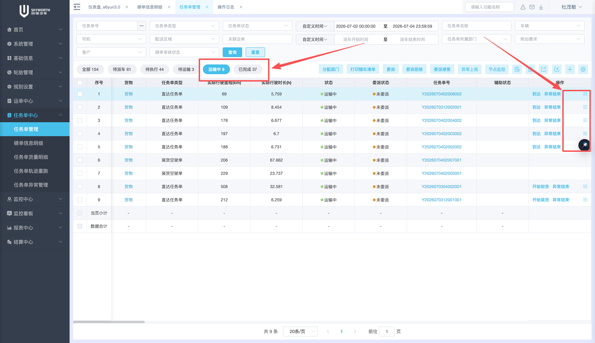
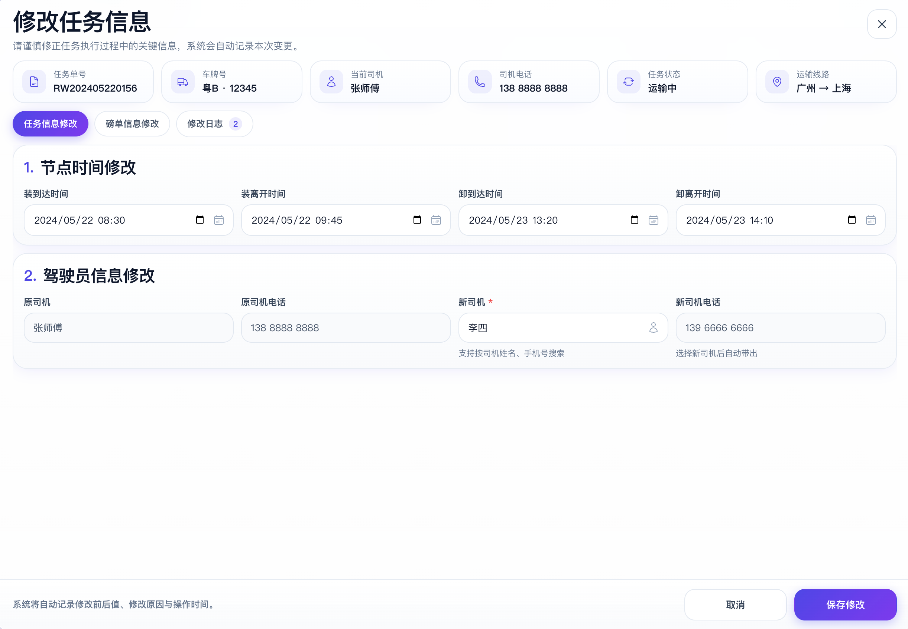
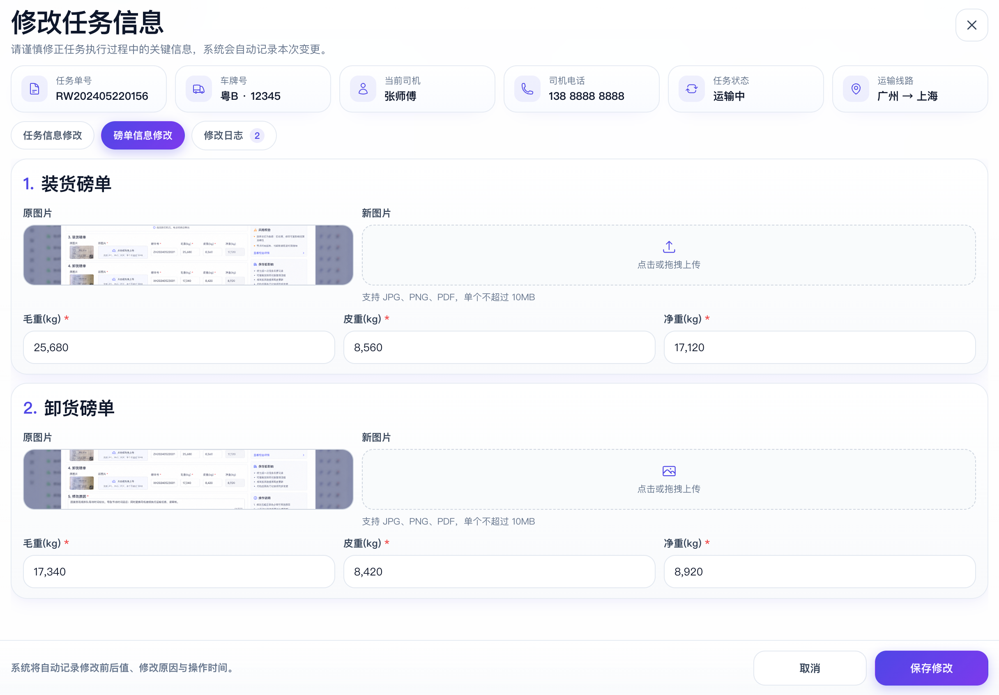
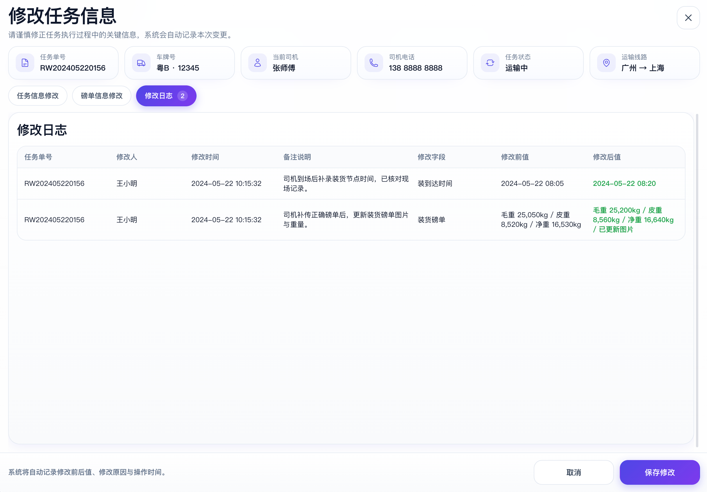

# 260704任务单信息修正

## 一、修订信息

| 时间 | 版本 | 修订人 | 内容 |
| --- | --- | --- | --- |
| 2026/07/14 | V1.0.1 | 杜茂敏 | 创建，基于现有G7系统修改。 |
|  |  |  |  |

## 二、功能概述

在「任务单管理」中新增或升级「修改信息」功能，支持后台人员对任务单执行过程中的关键信息进行人工修正。

本功能支持修改以下内容：

- 装到达时间；
- 装离开时间；
- 卸到达时间；
- 卸离开时间；
- 驾驶员信息；
- 装货磅单信息；
- 卸货磅单信息；
- 装货磅单图片、毛重、皮重、净重；
- 卸货磅单图片、毛重、皮重、净重。

后台人员可在「任务单管理」列表中点击「修改信息」，打开弹窗后对节点时间、驾驶员信息、装卸货磅单信息进行修改，并填写修改原因。

系统保存后，需要同步更新任务单相关字段，并记录修改人、修改时间、修改原因、修改字段、修改前值、修改后值，方便后续业务追溯、异常复盘和财务对账。

本功能主要用于解决司机未操作、司机操作错误、后台补录错误、调度派错司机、实际执行司机与任务单司机不一致、磅单绑定错误、磅单重量录入错误等问题。

## 三、需求背景

#### 3.1 节点时间修正背景

| 节点时间 | 说明 |
| --- | --- |
| 装到达时间 | 车辆到达装货点的时间 |
| 装离开时间 | 车辆离开装货点的时间 |
| 卸到达时间 | 车辆到达卸货点的时间 |
| 卸离开时间 | 车辆离开卸货点的时间 |

这四个时间用于记录任务单实际执行过程，是判断任务进度、任务完成情况、装卸耗时、运输耗时、是否超时的重要依据。原文档中也明确指出，这四个节点时间会影响任务进度、运输耗时、装卸耗时、是否超时等业务判断

在实际业务中，存在以下问题：

- 司机忘记点击到达或离开；
- 司机操作节点顺序错误；
- 司机网络异常导致操作时间未及时上传；
- 后台补录时间错误；
- 司机实际操作时间与系统记录时间不一致；
- 调度或运营人员后续核对发现时间异常。

因此，后台需要支持对四个关键节点时间进行修正，并完整记录修改日志。

#### 3.2 驾驶员信息修正背景

当前任务单会绑定司机信息，用于标识任务实际执行人。但实际业务中，可能出现以下情况：

- 调度派车时选择了错误司机；
- 实际执行司机与任务单绑定司机不一致；
- 运输过程中临时更换司机；
- 司机账号、司机姓名、司机手机号维护错误；
- 司机小程序实际操作人与后台任务单展示司机不一致；
- 财务、绩效或异常追责时发现司机信息错误。

如果驾驶员信息无法修正，会导致以下问题：

- 任务执行责任人错误；
- 司机绩效统计错误；
- 异常责任判定错误；
- 小程序任务归属错误；
- 财务结算或司机费用归属错误；
- 操作日志追溯困难。

因此，需要在任务单中提供驾驶员信息修正能力。

#### 3.3 磅单信息修正背景

一个任务单通常会关联装货磅单和卸货磅单。磅单中的毛重、皮重、净重会影响任务货量、运输完成量、客户对账、承运商结算和财务审核。

实际业务中可能出现以下问题：

- 装货磅单绑定错误；
- 卸货磅单绑定错误；
- 磅单号录入错误；
- 磅单图片上传错误；
- 毛重、皮重、净重录入错误；
- 装卸货磅单上传顺序错误；
- 司机补传磅单时填错重量；
- 后台补录磅单时填错重量；
- 财务对账时发现磅单数据与纸质磅单或客户确认数据不一致；
- 异常补单导致旧任务单和新任务单磅单重复，产生重复结算风险。

如果磅单信息不能修正，会直接影响财务对账和结算准确性。因此，需要在任务单中支持装卸货磅单及重量信息修改，并对已对账、已开票、已付款的数据进行控制。

## 四、产品目标

- 支持后台快速修正任务单四个关键节点时间。
- 支持后台修正任务单驾驶员信息。
- 支持后台修正装货磅单和卸货磅单信息。
- 支持后台修正装卸货磅单的毛重、皮重、净重。
- 修改后自动记录完整修改日志。
- 修改后同步关联页面和关联字段取值。
- 降低因补单、错单、错磅单导致的财务对账异常。
- 防止已对账、已开票、已付款数据被随意修改。
- 保证任务单执行数据准确、可追溯、可核验。

## 五、适用人群

| 角色 | 使用场景 |
| --- | --- |
| 调度员 | 修正任务节点时间、修正司机信息、修正司机操作错误导致的数据异常 |
| 财务人员 | 查看磅单修改记录，核对财务对账数据 |
| 系统管理员 | 配置功能权限、查看完整修改日志 |

## 六、功能边界定义

本次功能只做简单修改，不做复杂流程，功能清单如下：

| 功能 | 是否支持 | 说明 |
| --- | --- | --- |
| 修改装到达时间 | 支持 | 原时间为空时允许补录 |
| 修改装离开时间 | 支持 | 原时间为空时允许补录 |
| 修改卸到达时间 | 支持 | 原时间为空时允许补录 |
| 修改卸离开时间 | 支持 | 原时间为空时允许补录 |
| 修改驾驶员信息 | 支持 | 支持修改任务单主司机 |
| 修改装货磅单图片 | 支持 | 支持重新上传，修改 |
| 修改卸货磅单图片 | 支持 | 支持重新上传，修改 |
| 修改装货毛重、皮重、净重 | 支持 | 需进行重量校验（净重计算） |
| 修改卸货毛重、皮重、净重 | 支持 | 需进行重量校验（净重计算） |
| 修改原因必填 | 支持 | 所有修改均需填写备注 |
| 修改日志记录 | 支持 | 自动记录修改前后值 |
| 权限控制 | 支持 | 写入操作权限配置树 |
| 小程序同步 | 支持 | 同步任务详情展示 |

## 七、功能清单

### 7.1pc端

| 一级功能 | 二级功能 | 说明 |
| --- | --- | --- |
| 任务单管理 | 编辑入口 | 在任务单列表操作栏增加「编辑」 |
| 修改任务信息 | 任务基础信息展示 | 只读展示任务单号、车牌号、司机、状态、线路、财务状态 |
| 修改任务信息 | 节点时间修改 | 修改四个关键节点时间 |
| 修改任务信息 | 驾驶员信息修改 | 修改任务单主司机 |
| 修改任务信息 | 装货磅单修改 | 修改装货磅单图片、毛重、皮重、净重 |
| 修改任务信息 | 卸货磅单修改 | 修改卸货磅单图片、毛重、皮重、净重 |
| 修改任务信息 | 修改原因填写 | 保存前必须填写 |
| 修改任务信息 | 保存前校验 | 校验状态 |
| 修改日志 | 日志列表 | 展示修改记录 |
| 权限配置 | 操作权限配置 | 控制不同角色是否可修改（角色按钮控制树） |

### 7.2小程序功能清单

| 一级功能 | 二级功能 | 说明 |
| --- | --- | --- |
| 司机任务 | 任务详情同步 | 展示后台修正后的节点时间、司机信息、磅单信息 |
| 司机任务 | 司机变更处理 | 运输中变更司机后，新司机可查看任务 |
| 司机任务 | 原司机任务处理 | 原司机不再操作该任务，历史操作记录保留 |
| 任务日志 | 操作记录展示 | 可展示后台修改记录 |
| 数据刷新 | 任务详情刷新 | 重新进入或下拉刷新后展示最新数据 |

## 八、页面设计

### 8.1功能入口

在「任务单管理」列表操作栏增加button：编辑

如果操作栏空间不足，可放到「更多」中：更多-编辑

### 8.2按钮展示规则

| 任务状态 | 按钮展示 | 说明 |
| --- | --- | --- |
| 磅单复审通过 | 不展示 | 复审后任务单锁定不允许修改 |
| 运输中 | 正常可点击 | 允许修改，保存时二次确认 |
| 已完成 | 正常可点击 | 允许修改，保存时二次确认 |
| 其他状态 | 不展示 |  |

### 8.3弹窗设计

弹窗名称：修改任务信息

#### 弹窗结构

弹窗分为 5 个区域：任务基础信息；任务信息修改（节点时间修改+驾驶员信息修改）；磅单信息修改；修改原因；修改日志。

#### 任务基础信息

基础信息只做只读展示，用于确认当前修改的任务单

| 字段 | 是否展示 | 是否可编辑 | 说明 |
| --- | --- | --- | --- |
| 任务单号 | 是 | 否 | 当前任务单编号 |
| 车牌号 | 是 | 否 | 当前执行车辆 |
| 当前司机 | 是 | 否 | 当前任务绑定司机 |
| 当前司机电话 | 是 | 否 | 当前任务绑定司机手机号 |
| 任务状态 | 是 | 否 | 当前任务状态 |
| 运输线路 | 是 | 否 | 装货地 - 卸货地 |

#### 时间节点修改

| 字段 | 类型 | 是否可编辑 | 是否必填 | 说明 |
| --- | --- | --- | --- | --- |
| 装到达时间 | 日期时间选择器 | 是 | 否 | 可修改或补录 |
| 装离开时间 | 日期时间选择器 | 是 | 否 | 可修改或补录 |
| 卸到达时间 | 日期时间选择器 | 是 | 否 | 可修改或补录 |
| 卸离开时间 | 日期时间选择器 | 是 | 否 | 可修改或补录 |

#### 时间字段交互规则

- 打开弹窗时，系统默认带出当前已有时间；
- 如果原时间为空，则对应字段为空，允许后台补录；
- 用户可只修改其中一个时间；
- 用户也可同时修改多个时间；
- 不单独展示「原时间 / 新时间」两列，页面只展示当前可编辑时间；
- 保存时由系统自动记录修改前值和修改后值；
- 时间精度建议到秒，格式为：YYYY-MM-DD HH:mm:ss

#### 驾驶员信息修改字段

| 字段 | 类型 | 是否展示 | 是否可编辑 | 是否必填 | 说明 |
| --- | --- | --- | --- | --- | --- |
| 原司机 | 文本 | 是 | 否 | 否 | 当前任务绑定司机 |
| 原司机电话 | 文本 | 是 | 否 | 否 | 当前司机手机号 |
| 新司机 | 下拉选择/搜索选择 | 是 | 是 | 是 | 从司机档案中选择 |
| 新司机电话 | 自动带出 | 是 | 否 | 是 | 根据新司机自动带出 |

#### 驾驶员信息交互规则

- 打开弹窗时，系统默认展示当前司机信息。
- 用户点击「新司机」字段，可按司机姓名、手机号搜索司机。
- 选择新司机后，系统自动带出司机姓名、电话。
- 如果选择的新司机状态为停用，驾驶员筛选器不带出值。
- 如果新司机与原司机相同，视为未修改。
- 驾驶员信息可与节点时间、磅单信息同时修改。
- 保存时系统自动记录原司机和新司机信息。
- 修改成功后，任务单列表、任务单详情、小程序任务详情同步展示新司机信息。

#### 装卸货磅单信息字段

| 字段 | 类型 | 是否展示 | 是否可编辑 | 是否必填 | 说明 |
| --- | --- | --- | --- | --- | --- |
| 原装/卸货磅单图片 | 图片预览 | 是 | 否 | 否 | 当前装货磅单图片 |
| 新装/卸货磅单图片 | 上传组件 | 是 | 是 | 否 | 支持重新上传 |
| 装/卸货毛重 | 数字输入框 | 是 | 是 | 否 | 单位按系统现有单位 |
| 装/卸货皮重 | 数字输入框 | 是 | 是 | 否 | 单位按系统现有单位 |
| 装/卸货净重 | 数字输入框/自动计算 | 是 | 是 | 否 | 净重 = 毛重 - 皮重 |

#### 修改原因

| 字段 | 类型 | 是否必填 | 说明 |
| --- | --- | --- | --- |
| 备注说明 | 文本框 | 否 | 必填（字数限制与之前逻辑一样） |

#### 修改日志

系统保存修改时，必须记录修改日志，不允许无痕覆盖。

#### 修改日志列表字段

| 字段 | 说明 |
| --- | --- |
| 任务单号 | 被修改的任务单 |
| 修改人 | 当前操作人 |
| 修改时间 | 用户点击保存成功的时间 |
| 备注说明 | 用户填写的备注 |
| 修改字段 | 被修改的节点时间字段 |
| 修改前值 | 修改前时间 |
| 修改后值 | 修改后时间 |

#### 底部按钮

取消、保存

## 九、业务字段校验规则

| 修改类型 | 校验规则 | 不通过提示 |
| --- | --- | --- |
| 节点时间 | 装到达时间 ≤ 装离开时间 ≤ 卸到达时间 ≤ 卸离开时间 | 节点时间顺序不正确，请检查后重新保存 |
| 节点时间 | 四个节点时间均不能大于当前系统时间 | 节点时间不能大于当前时间 |
| 驾驶员信息 | 新司机不能为空 | 请选择新司机 |
| 驾驶员信息 | 新司机不能与老司机一样 | 请选择新司机 |
| 磅单信息 | 毛重、皮重、净重仅支持数字 | 请输入正确的重量格式 |
| 磅单信息 | 毛重必须大于或等于皮重 | 毛重不能小于皮重 |
| 磅单信息 | 净重必须大于或等于 0 | 净重不能小于 0 |
| 磅单信息 | 净重 = 毛重 - 皮重 | 同原来逻辑，系统自动计算 |
| 通用 | 修改原因必填 | 请填写备注说明 |
| 通用 | 修改内容必须发生变化 | 当前信息未发生变化，无需保存 |

#### 保存后处理规则

用户保存成功后，系统需要执行以下处理：

| 处理事项 | 说明 |
| --- | --- |
| 更新节点时间 | 更新任务单四个节点时间 修改时间关联字段 |
| 更新驾驶员信息 | 更新任务单主司机、司机电话 |
| 更新装货磅单信息 | 更新装货磅单图片、毛重、皮重、净重 |
| 更新卸货磅单信息 | 更新卸货磅单图片、毛重、皮重、净重 |
| 重新计算车辆里程 | 时间修改后，按照原有逻辑重新计算车辆里程 |
| 同步任务单列表 | 刷新列表展示字段 |
| 同步任务单详情 | 展示最新节点时间、司机信息、磅单信息 |
| 同步小程序任务详情 | 展示最新任务信息 |
| 同步磅单信息明细 | 磅单明细取最新磅单数据 |
| 同步任务货量明细 | 如果货量依赖净重，需要同步更新 |
| 同步后续对账取值 | 后续对账取任务单当前最新数据 |
| 记录修改日志 | 记录修改人、修改时间、修改原因、修改字段、修改前值、修改后值 |
| 添加操作记录 | 在任务详情中展示本次修改记录 |
