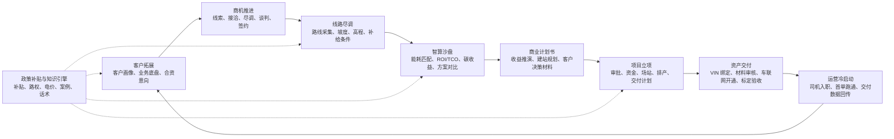

# 市场转化管理中心 - 产品架构图

## 1. 产品架构总览

```mermaid
flowchart TB
    %% =======================
    %% 用户与入口层
    %% =======================
    subgraph L1["用户与入口层"]
        direction LR
        U1["前线销售 / BD"]
        U2["售前专家"]
        U3["项目经理 / 交付团队"]
        U4["销售经理 / 管理层"]
        U5["法务 / 运营 / 政策研究员"]

        C1["移动端 APP<br/>现场采集、拜访跟进、交付验收"]
        C2["PC 工作台<br/>看板管理、沙盘推演、合同与项目管理"]
        C3["客户侧交付物<br/>商业计划书 PDF / Web 分享链接"]
    end

    U1 --> C1
    U2 --> C2
    U3 --> C1
    U3 --> C2
    U4 --> C2
    U5 --> C2

    %% =======================
    %% 业务应用层
    %% =======================
    subgraph L2["业务应用层"]
        direction LR

        subgraph M1["大宗客户与商机管理"]
            direction TB
            M11["客户 360 画像<br/>资质、环保评级、车队、货品、油耗"]
            M12["客户信息采集<br/>APP 录入、OCR、语音、照片、定位"]
            M13["商机漏斗<br/>线索、接洽、尽调、沙盘、谈判、签约"]
            M14["跟进记录与干系人图谱<br/>拜访日志、决策链、竞品动态"]
            M15["合同与协议管理<br/>模板库、电子签、归档、存证"]
        end

        subgraph M2["售前尽调与智算沙盘"]
            direction TB
            M21["移动端线路采集<br/>起终点、途经点、GPS 轨迹"]
            M22["路网与高程仿真<br/>里程、坡度、重载上下坡路段"]
            M23["能耗与补给评估<br/>相似线路能耗、充换电站、电网容量"]
            M24["ROI / TCO 算账模型<br/>油电差、3/5 年成本、回收期、碳收益"]
            M25["商业计划书生成<br/>收益推演、建站规划、方案对比"]
        end

        subgraph M3["项目立项与全流程交付追踪"]
            direction TB
            M31["项目里程碑工作台<br/>立项、资金、建站、排产、交付、首单"]
            M32["SLA 卡点预警<br/>红黄绿状态、负责人、管理层提醒"]
            M33["车辆资产交付<br/>VIN 批量绑定、发车清单、项目资产"]
            M34["交付材料收集夹<br/>发票、合格证、营运证、保险单"]
            M35["车联网初始化与标定验收<br/>TSP 账号、DMS / ADAS 测试日志"]
        end

        subgraph M4["政策补贴与知识引擎"]
            direction TB
            M41["区域政策数据库<br/>购车补贴、运营补贴、路权限制"]
            M42["全国电价策略字典<br/>尖峰平谷时段与工业电价"]
            M43["政策查询与主动推送<br/>按客户所在地匹配政策"]
            M44["案例与话术知识库<br/>破冰话术、抗拒点、标杆案例"]
        end
    end

    C1 --> M1
    C1 --> M2
    C1 --> M3
    C2 --> M1
    C2 --> M2
    C2 --> M3
    C2 --> M4
    M25 --> C3

    %% 核心业务闭环
    M1 -->|"客户画像 / 商机数据"| M2
    M2 -->|"沙盘结论 / 收益方案"| M3
    M1 -->|"签约客户 / 合同档案"| M3
    M3 -->|"交付进度 / 冷启动数据回传"| M1

    %% 支撑赋能
    M4 -.->|"政策、路权、补贴、话术"| M1
    M4 -.->|"电价、补贴、路权参数"| M2
    M4 -.->|"政策与合规依据"| M3

    %% =======================
    %% 平台能力层
    %% =======================
    subgraph L3["平台能力层"]
        direction LR
        P1["工作流与 SLA 引擎<br/>阶段推进、检查项、审批、预警"]
        P2["仿真与计算引擎<br/>路谱分析、能耗匹配、TCO、碳收益"]
        P3["文档与签约服务<br/>报告模板、PDF 生成、电子签、存证"]
        P4["采集与文件服务<br/>OCR、拍照、录音、定位、对象存储"]
        P5["消息与权限服务<br/>APP 推送、角色权限、组织与项目权限"]
    end

    M1 --> P1
    M1 --> P3
    M1 --> P4
    M2 --> P2
    M2 --> P3
    M3 --> P1
    M3 --> P4
    M3 --> P5
    M4 --> P5

    %% =======================
    %% 数据资产层
    %% =======================
    subgraph L4["数据资产层"]
        direction LR
        D1["客户主数据 / 商机库"]
        D2["线路与路谱库"]
        D3["历史运营能耗库"]
        D4["政策补贴 / 电价库"]
        D5["合同 / 报告 / 项目文档库"]
        D6["车辆资产 / VIN / 车联网账号库"]
        D7["案例话术 / 知识库"]
    end

    P1 --> D1
    P1 --> D5
    P2 --> D2
    P2 --> D3
    P2 --> D4
    P3 --> D5
    P4 --> D5
    P5 --> D1
    M3 --> D6
    M4 --> D4
    M4 --> D7

    %% =======================
    %% 外部系统与数据源
    %% =======================
    subgraph L5["外部系统与数据源"]
        direction LR
        E1["工商 / 环保 / 政策公开数据"]
        E2["高德 / 百度 / 高精地图 API"]
        E3["充换电站 / 电网容量数据"]
        E4["主机厂 ERP<br/>发车清单、VIN、车型"]
        E5["TSP 车联网平台<br/>账号开通、车辆在线状态"]
        E6["第三方电子签 / 区块链存证"]
        E7["对象存储 / 消息推送服务"]
    end

    E1 --> D1
    E1 --> D4
    E2 --> P2
    E3 --> P2
    E4 --> D6
    E5 --> D6
    E6 --> P3
    E7 --> P4
    E7 --> P5

    classDef user fill:#eef6ff,stroke:#4b83c4,color:#10233f
    classDef module fill:#f5fff4,stroke:#4b9b63,color:#12351f
    classDef platform fill:#fff8e8,stroke:#c58a1e,color:#3f2a05
    classDef data fill:#f7f2ff,stroke:#8a63c7,color:#24113f
    classDef external fill:#f7f7f7,stroke:#888,color:#222

    class U1,U2,U3,U4,U5,C1,C2,C3 user
    class M11,M12,M13,M14,M15,M21,M22,M23,M24,M25,M31,M32,M33,M34,M35,M41,M42,M43,M44 module
    class P1,P2,P3,P4,P5 platform
    class D1,D2,D3,D4,D5,D6,D7 data
    class E1,E2,E3,E4,E5,E6,E7 external
```

## 2. 核心业务闭环

## 3. 模块定位速览

| 层级 | 模块 | 核心价值 |
| --- | --- | --- |
| 用户与入口层 | APP、PC、客户侧报告 | 覆盖现场采集、管理工作台和客户决策材料输出 |
| 业务应用层 | 大宗客户与商机管理 | 沉淀客户底盘数据，管理从线索到签约的销售转化过程 |
| 业务应用层 | 售前尽调与智算沙盘 | 用路线、能耗、电价、补贴、TCO 等数据生成项目收益方案 |
| 业务应用层 | 项目立项与交付追踪 | 管理从合同到车辆上线、首单跑通的重资产履约过程 |
| 业务应用层 | 政策补贴与知识引擎 | 为销售破冰、沙盘计算和合规交付提供政策与知识支撑 |
| 平台能力层 | 工作流、计算、文档、采集、消息权限 | 支撑跨模块流转、自动预警、报告生成和数据采集 |
| 数据资产层 | 客户、商机、路谱、能耗、政策、电价、车辆、文档、知识 | 形成可复用的数据底座，让后续项目推演越来越准 |
| 外部系统层 | 地图、ERP、TSP、电子签、存储、政策数据 | 对接业务完成所需的外部数据和系统能力 |

